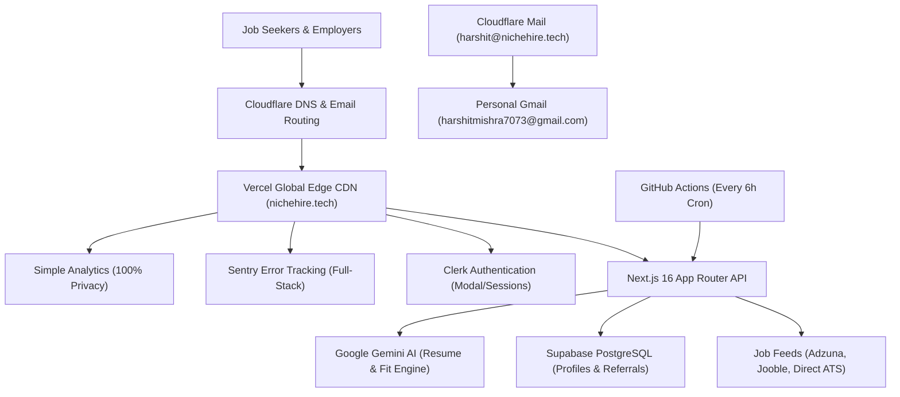

# NicheHire — Integrated Tools, Infrastructure & Membership Expiration Workbook
**Platform**: [NicheHire (nichehire.tech)](https://www.nichehire.tech)  
**Founder & Administrator**: Harshit Mishra (`harshitmishra7073@gmail.com` | `harshit@nichehire.tech`)  
**GitHub Repository**: [`harshit1834/nichehire`](https://github.com/harshit1834/nichehire)  
**Last Updated**: September 30, 2026  

---

## 1. Executive Summary

NicheHire is built on a modern, highly scalable, cost-optimized stack leveraging the **GitHub Student Developer Pack**, cloud services, and edge computing. The entire infrastructure is structured so that **operational running costs remain $0/month**, while offering enterprise-grade speed, security, and developer observability.

---

## 2. Integrated Tools & Services Breakdown

### 2.1 Domain & Custom Email System
* **Domain**: `nichehire.tech` (Primary URL: `https://www.nichehire.tech`)
  * **Provider**: Namecheap / Radix (`.TECH`) via GitHub Student Developer Pack.
  * **Role**: Primary production identity, SEO foundation, SSL certificates.
  * **Status**: **Active & Verified** with 308 permanent redirect from apex (`nichehire.tech`) and legacy domains (`nichehire.in`, `nichehire-psi.vercel.app`).
  * **Membership / Expiration**: **1 Year Free** (Expires **September 2027**). Renewal is standard low-cost ($4–$8/yr with student promo or standard registrar pricing).

* **Custom Email Routing (`harshit@nichehire.tech` & `founder@nichehire.tech`)**:
  * **Architecture**: **Cloudflare Email Routing + Gmail System**.
  * **Inbound Handling**: Cloudflare MX and SPF/DKIM DNS records intercept all incoming mail to `harshit@nichehire.tech` and forward it instantly to `harshitmishra7073@gmail.com`.
  * **Outbound Handling**: Integrated via Gmail's native *"Send mail as"* feature using Google SMTP or custom API keys, allowing you to compose and reply to candidates and employers directly as `harshit@nichehire.tech`.
  * **Cost / Expiration**: **100% Free Forever** (Bypasses Google Workspace's \$6/user/month fee with zero ongoing cost).

---

### 2.2 Authentication & User Management
* **Tool**: **Clerk** (`@clerk/nextjs`)
  * **Dashboard**: [dashboard.clerk.com](https://dashboard.clerk.com)
  * **Role in NicheHire**:
    * Passwordless candidate login and Google OAuth.
    * Modal sign-in experience (`<SignInButton mode="modal">`).
    * User profile drawer and account badge (`<UserButton />`).
    * Synchronized with local candidate storage and Supabase user profiles.
  * **Plan / Quota**: Free Developer Tier via GitHub Student Developer Pack (up to **10,000 Monthly Active Users** free).
  * **Expiration**: **Never Expires** (Free perpetual tier).

---

### 2.3 Error Tracking & Full-Stack Telemetry
* **Tool**: **Sentry** (`@sentry/nextjs`)
  * **Dashboard**: [niche-hire.sentry.io](https://niche-hire.sentry.io)
  * **Organization**: `niche-hire`
  * **Project**: `javascript-nextjs`
  * **Role in NicheHire**:
    * Real-time crash reporting across client React components (`app/global-error.tsx`, `app/error.tsx`).
    * Server-side error capture (`sentry.server.config.ts`, `instrumentation.ts`).
    * Vercel Edge middleware exception detection (`sentry.edge.config.ts`).
    * Automated release tracking & source map symbolication via Sentry Auth Token (`SENTRY_AUTH_TOKEN`).
    * Ad-blocker resistant error tunnel via `/monitoring`.
    * Live test verification endpoint at `/api/test-sentry`.
  * **Plan / Quota**: GitHub Student Developer Pack benefit (Includes 50,000 error events/month, 100,000 performance units).
  * **Expiration & Trial Details**:
    * The **14-day Business Tier trial** (which enables advanced team replays and metrics) expires around **October 14, 2026**.
    * **No action required**: After the 14 days, your account **automatically reverts to the permanent Free Developer Tier**. You will never be charged, and error tracking will continue running smoothly.
  * **Build Authentication**: `SENTRY_AUTH_TOKEN`, `SENTRY_ORG`, and `SENTRY_PROJECT` configured in Vercel project environment variables for production source map release management.

---

### 2.4 Privacy-First Web Analytics
* **Tool**: **Simple Analytics**
  * **Dashboard**: [simpleanalytics.com](https://simpleanalytics.com)
  * **Role in NicheHire**:
    * 100% cookie-free, privacy-preserving web analytics.
    * Compliant with GDPR, PECR, and India's DPDP Act without annoying cookie consent banners.
    * Embedded in `app/layout.tsx` with `<noscript>` fallback.
  * **Plan / Quota**: GitHub Student Developer Pack benefit (1 Year Free Student Subscription).
  * **Expiration**: **September 2027** (12 months from activation).

* **Tool**: **Vercel Web Analytics** (`@vercel/analytics`)
  * **Role in NicheHire**: Core Web Vitals monitoring (LCP, FID, CLS) and real-user edge latency tracking.
  * **Plan / Quota**: Free tier included with Vercel Hobby plan.
  * **Expiration**: **Perpetual Free Tier**.

---

### 2.5 Database & Data Architecture
* **Tool**: **Supabase** (`@supabase/supabase-js`)
  * **Dashboard**: [supabase.com/dashboard](https://supabase.com/dashboard)
  * **Role in NicheHire**:
    * PostgreSQL relational storage for `user_profiles`, `referrals`, `job_listings`, `founder_overrides`, `team_permissions`, `premium_usage`, and employer payments.
    * Row-Level Security (RLS) policies protecting sensitive user records.
    * Real-time query support for job search filtering and tier calculations.
  * **Plan / Quota**: Free Tier (500 MB database storage, 1 GB file storage, 50,000 MAU, 500k edge functions/mo).
  * **Expiration**: **Perpetual Free Tier**.

---

### 2.6 Artificial Intelligence & Candidate Fit Engines
* **Tool**: **Google Gemini API** (`@google/genai` & `@google/generative-ai`)
  * **Console**: [aistudio.google.com](https://aistudio.google.com)
  * **Role in NicheHire**:
    * AI Resume Parser: Extracts skills, experience, and education from uploaded PDF/Word resumes.
    * Candidate Fit Engine: Calculates percentage match between candidate resume and live verified job postings.
    * AI Resume Tailor: Automatically aligns bullet points with target job descriptions.
    * Recruiter Outreach Generator: Drafts high-converting LinkedIn and email outreach messages.
    * Interview Preparation: Generates tailored interview questions and answers based on specific job listings.
  * **Plan / Quota**: Free Tier via Google AI Studio API Key (15 Requests Per Minute / 1,500 Requests Per Day on Gemini 1.5/2.0 Flash).
  * **Expiration**: **Perpetual Free Tier**.

---

### 2.7 Automated Background Sync & Crons
* **Tool**: **GitHub Actions** (`.github/workflows/job-sync-cron.yml`)
  * **Role in NicheHire**:
    * Automated cron workflow triggered every 6 hours (`0 */6 * * *`).
    * Audits Himalayas, RemoteOK, Adzuna, and direct corporate portals, purging jobs older than 7 days and warming search caches.
  * **Plan / Quota**: Free perpetual tier (2,000 free runner minutes/month; unlimited for public GitHub repositories).
  * **Expiration**: **Never Expires**.

* **Tool**: **Vercel Cron Jobs** (`vercel.json`)
  * **Role in NicheHire**: Daily cache warm-up and government exam deadline audit.
  * **Plan / Quota**: 1 free cron job per project on Vercel Hobby plan.
  * **Expiration**: **Perpetual Free Tier**.

---

### 2.8 Job Aggregators & Data Ingestion
* **Adzuna API**: Primary job aggregator feed for Indian domestic jobs. (Free Tier API Key).
* **Jooble API**: Supplementary job search engine. (Free Tier API Key).
* **RapidAPI / JSearch**: On-demand search query fallback. (Free Tier: 500 requests/month).
* **ScrapingDog**: Rotating proxy scraper for direct company career pages. (Free Tier: 1,000 requests).
* **Zyte (Scrapy Cloud & Smart Proxy Engine)**:
  * **Role in NicheHire**:
    1. **Anti-Bot Unblocker (`ZYTE_API_KEY`)**: Used in `app/api/jobs/details/route.ts` to automatically bypass Cloudflare/Akamai 403 blocks and extract full job descriptions from corporate career sites.
    2. **Cloud Spider Runner (`ZYTE_SCRAPY_KEY`)**: Project `880275` running on Zyte's free Kumo cloud container, executing custom Python Scrapy crawlers without consuming GitHub Actions or Vercel compute.
  * **Account**: Registered under `harshitmishra7073@gmail.com` via GitHub Student Developer Pack.
  * **Plan / Quota**: **1 Free Forever Kumo Unit** on Scrapy Cloud (120 hrs/mo) + $5 free trial scraping allowance.
  * **Expiration**: **Perpetual Free Tier** (Never expires).
* **Direct ATS Portals**: Zero-cost direct HTTP scrapers for Greenhouse, Lever, Workday, and SmartRecruiters.

---

## 3. Master Membership Expiration & Renewal Schedule

| Tool / Service | Category | Integration Method | Plan / Benefit | Expiration / Renewal Date | Action Required Upon Expiry |
|---|---|---|---|---|---|
| **.TECH Domain** (`nichehire.tech`) | Domain / DNS | Namecheap & Vercel DNS | GitHub Student Pack (1 Yr Free) | **September 2027** | Renew domain (~$4–$8/yr) or transfer registrar |
| **Cloudflare + Gmail** (`harshit@nichehire.tech`) | Custom Email | Cloudflare MX & Gmail SMTP | Free Cloudflare Email Routing | **Perpetual (Never)** | None — 100% Free Forever |
| **Simple Analytics** | Web Analytics | Embedded Script (`app/layout.tsx`) | GitHub Student Pack (1 Yr Free) | **September 2027** | Renew student plan or switch to Vercel Analytics |
| **Sentry** | Error Tracking | `@sentry/nextjs` (Client/Server/Edge) | GitHub Student Pack / Business Trial | **Trial: Oct 14, 2026** (Auto-reverts to Free Tier) | None — Reverts to Developer Free Tier ($0/mo) |
| **Clerk** | Auth & Users | `@clerk/nextjs` & Middleware | Free Developer Tier (10k MAU) | **Perpetual (Never)** | None — Free within 10,000 MAU |
| **Vercel** | Hosting & CDN | GitHub CI/CD & Edge Network | Hobby Tier ($0/month) | **Perpetual (Never)** | None — Free within generous hobby limits |
| **Supabase** | PostgreSQL DB | `@supabase/supabase-js` API | Free Tier (500 MB DB) | **Perpetual (Never)** | None — Active queries prevent pausing |
| **Google Gemini API** | AI / LLM Engine | `@google/genai` API Key | AI Studio Free Tier (15 RPM) | **Perpetual (Never)** | None — Free within rate limits |
| **GitHub Actions** | Crons / Sync | `.github/workflows` | Free Tier (Unlimited on public repo) | **Perpetual (Never)** | None — Runs every 6 hours automatically |
| **Zyte (Scrapy Cloud)** | Web Scraping | `shub` / API & Proxy | GitHub Student Pack (1 Forever Unit) | **Perpetual (Never)** | None — Free 120 hrs/mo spider execution |
| **Adzuna / Jooble** | Job Feeds | REST APIs | Developer Free Keys | **Perpetual (Never)** | None — Perpetual developer access |

---

## 4. Key Security & Continuity Best Practices

1. **Email Reliability**:
   Because `harshit@nichehire.tech` routes directly to your personal `harshitmishra7073@gmail.com`, you never miss candidate queries, employer payment proofs, or system alerts.
2. **Referral Link Integrity**:
   All referral links in the code point to `https://www.nichehire.tech/?ref=YOUR_CODE`. The Vercel edge router automatically translates any legacy `.in` or `.vercel.app` visits to `.tech` with a permanent 308 redirect, preserving the `?ref=` query parameter 100% of the time.
3. **Founder Super-Admin Access**:
   Logging in with `harshitmishra7073@gmail.com`, `founder@nichehire.tech`, or `harshit@nichehire.tech` automatically grants full administrative rights on [`/admin`](https://www.nichehire.tech/admin) with zero database manual intervention.
